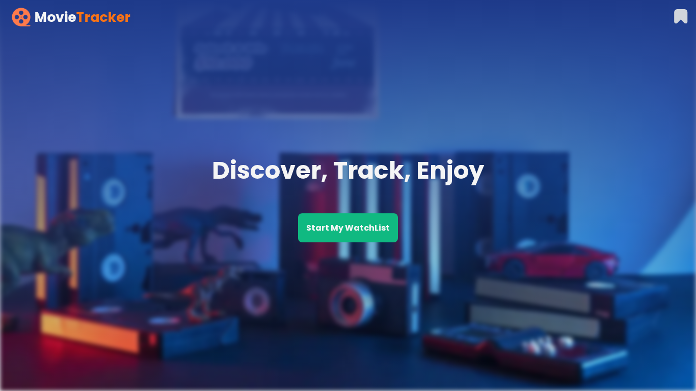
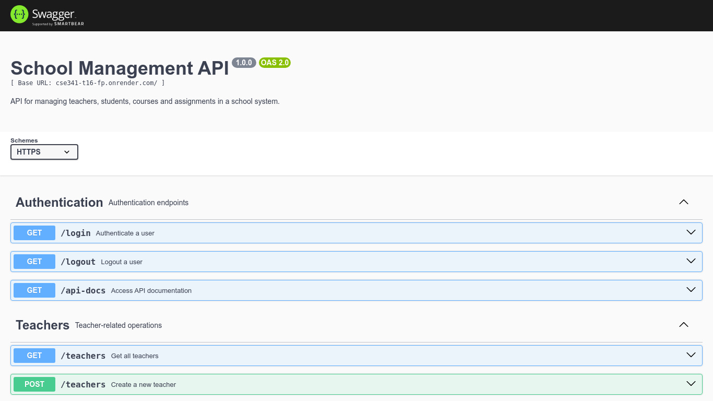

<!--
**vicentemferrer/vicentemferrer** is a ✨ _special_ ✨ repository because its `README.md` (this file) appears on your GitHub profile.
-->

# 👋 Hi, I'm Vicente

🎓 BS in Software Development | 💻 Passionate about building web experiences

## 🛠️ Skills & Technologies

#### Languages

#### Tools, Frameworks & Libraries

#### Databases

## 🚀 Latest Projects

<table>
  <tr>
    <td align="center" width="30%">
       
      <strong>Handcrafted Haven</strong> 
      Handicrafts marketplace app  
        <a href="https://handcrafted-haven-dun.vercel.app/">🔗 Visit</a> | <a href="https://github.com/Axelh98/handcrafted_haven">🔗 Repo</a>
    </td>
    <td align="center" width="30%">
       
      <strong>MovieTracker</strong> 
      Movie catalog with watchlist function  
        <a href="https://movietracker-wdd330.netlify.app/">🔗 Visit</a> | <a href="https://github.com/vicentemferrer/wdd330-movie-tracker">🔗 Repo</a>
    </td>
    <td align="center" width="30%">
       
      <strong>School Management API</strong> 
      School management service with Auth  
        <a href="https://cse341-t16-fp.onrender.com/api-docs/">🔗 Visit</a> | <a href="https://github.com/benjaminjalebeau/Students_API_MongoDB">🔗 Repo</a>
    </td>
  </tr>
</table>

## 📊 Stats

 

