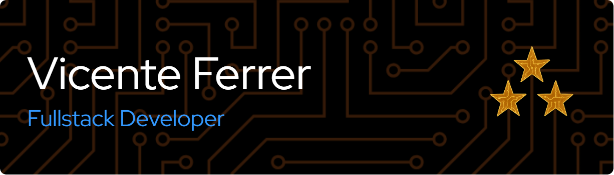

<!--
**vicentemferrer/vicentemferrer** is a ✨ _special_ ✨ repository because its `README.md` (this file) appears on your GitHub profile.
-->

# 👋 Hi, I'm Vicente

🎓 AAS in Software Development | 💻 Passionate about building web experiences

## 🛠️ Skills & Technologies

#### Languages

#### Tools, Frameworks & Libraries

#### Databases

## 🚀 Latest Projects

<table>
  <tr>
    <td align="center" width="30%">
       
      <strong>Handcrafted Haven</strong> 
      Handicrafts marketplace app  
        <a href="https://handcrafted-haven-dun.vercel.app/">🔗 Visit</a> | <a href="https://github.com/Axelh98/handcrafted_haven">🔗 Repo</a>
    </td>
    <td align="center" width="30%">
       
      <strong>MovieTracker</strong> 
      Movie catalog with watchlist function  
        <a href="https://movietracker-wdd330.netlify.app/">🔗 Visit</a> | <a href="https://github.com/vicentemferrer/wdd330-movie-tracker">🔗 Repo</a>
    </td>
    <td align="center" width="30%">
       
      <strong>School Management API</strong> 
      School management service with Auth  
        <a href="https://cse341-t16-fp.onrender.com/api-docs/">🔗 Visit</a> | <a href="https://github.com/benjaminjalebeau/Students_API_MongoDB">🔗 Repo</a>
    </td>
  </tr>
</table>

## 📊 Stats

 

<!-- ### Bachelor of Software Development Curriculum Status

- **Certificates**

  - 

      
<h4>Web and Computer Programming</h4> 

    | Course ID   | Course                           | Language                | Term Completion |
    |-------------|----------------------------------|-------------------------|-----------------|
    |   CSE 110   | Programming with Building Blocks | Python                  | **Winter 2023** |
    |   CSE 111   | Programming with Functions       | Python                  | **Spring 2023** |
    |   WDD 130   | Web Fundamentals                 | HTML & CSS              | **Spring 2023** |
    |   CSE 210   | Programming with Classes         | C#                      | **Fall 2023**   |
    |   CSE 121B  | Javascript Language              | Javascript              | **Fall 2023**   |
    |   WDD 230   | Web Frontend Development 1       | HTML & CSS & Javascript | **Winter 2024** |
    |  GS 170     | Career Development               |                         | **Fall 2023**   |

    

  - 

      
<h4>Web Development</h4> 

    | Course ID   | Course                           | Language                | Frameworks and Tools                                | Term Completion |
    |-------------|----------------------------------|-------------------------|-----------------------------------------------------|-----------------|
    |   CIT 111   | Introduction to Databases        | SQL                     | MySQL Server and MySQL Workbench                    | **Fall 2023**   |
    |   WDD 330   | Web Frontend Development 2       | HTML & CSS & Javascript | Vite, Trello and Netlify                            | **Fall 2024**   |
    |   CSE 340   | Web Backend Development          | Javascript              | Node.js, Express, PostgreSQL, pgAdmin and Render    | **Fall 2024**   |
    |   CSE 341   | Web Services                     | Javascript              | Node.js, Express, MongoDB, MongoDB Atlas and Render | **Fall 2024**   |
    |   WDD 430   | Web Full-stack Development       | HTML & CSS & Javascript | Next.js, PostgreSQL, GitHub Projects and Vercel     | **Winter 2025** |

    

  - 

      
<h4>Software Development</h4> 

    | Course ID   | Course                           | Language                | Frameworks and Tools                                | Term Completion |
    |-------------|----------------------------------|-------------------------|-----------------------------------------------------|-----------------|
    |   CSE 212   | Programming w/Data Struct        | C#                      |                                                     | **Winter 2025** |
    |   CSE 270   | Software Testing                 |                         | Docker and Squash                                   | Spring 2025     |
    |   CSE 300   | Professional Readiness           |                         |                                                     | Spring 2025     |
    |   CSE 310   | Applied Programming              |                         |                                                     | *Spring 2025*   |
    |   CSE 325   | .NET Software Development        |                         |                                                     | *Spring 2025*   |
    |   CSE 370   | Software Eng. Principles         |                         |                                                     | *Fall 2025*     |

    

- 

    
<h4>General Education</h4> 

  | Course ID   | Course                                        | Term Completion |
  |-------------|-----------------------------------------------|-----------------|
  |  PC 101     | Life Skills                                   | **Spring 2022** |
  |  PC 102     | Professional Skills                           | **Fall 2022**   |
  |  PC 103     | University Skills                             | **Winter 2023** |
  |  ENG 150    | Writing and Reasoning Foundations             | **Winter 2024** |
  |  MATH 108X  | Math for the Real World                       | **Winter 2024** |
  |  REL 200C   | The Eternal Family                            | **Fall 2022**   |
  |  REL 225C   | Foundations of the Restoration                | **Fall 2022**   |
  |  REL 250C   | Jesus Christ Everlasting Gospel               | **Fall 2023**   |
  |  REL 275C   | Teachings and Doctrines of the Book of Mormon | **Spring 2022** |
  |  REL 121    | The Book of Mormon (1 Nephi to Alma 30)       | **Fall 2022**   |
  |  REL 122    | The Book of Mormon (Alma 30 to Moroni)        | **Winter 2022** |
  |  REL 211    | The New Testament                             | **Winter 2023** |
  |  BUS 301    | Advanced Writing in Professional Contexts     | **Fall 2024**   |
  |  FCS 160    | Home and Family Resource Management           | **Winter 2025** |
  |  BUS 321    | Organizational Leadership                     | Spring 2025     |
  |  GESCI 110  | Sustaining Human Life                         | *Spring 2025*   |
  |  HUM 110    | Discovery and Discernment Through the Arts    | *Fall 2025*     |

  

- - [ ] **Senior Project** -->
